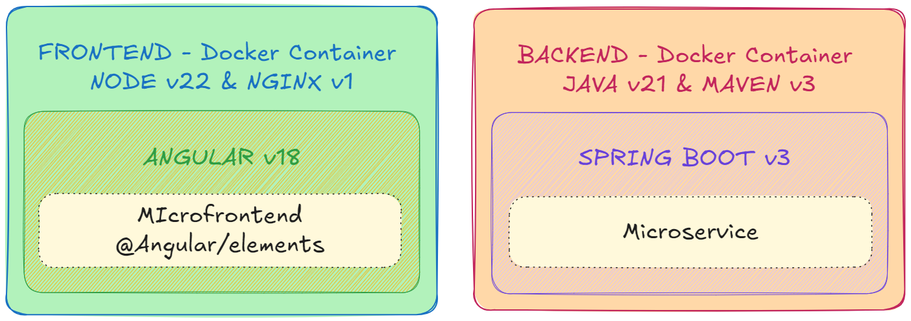
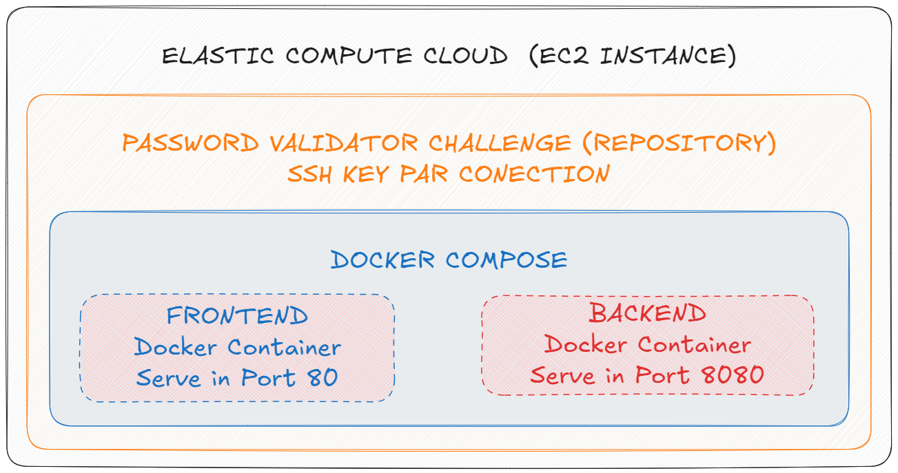
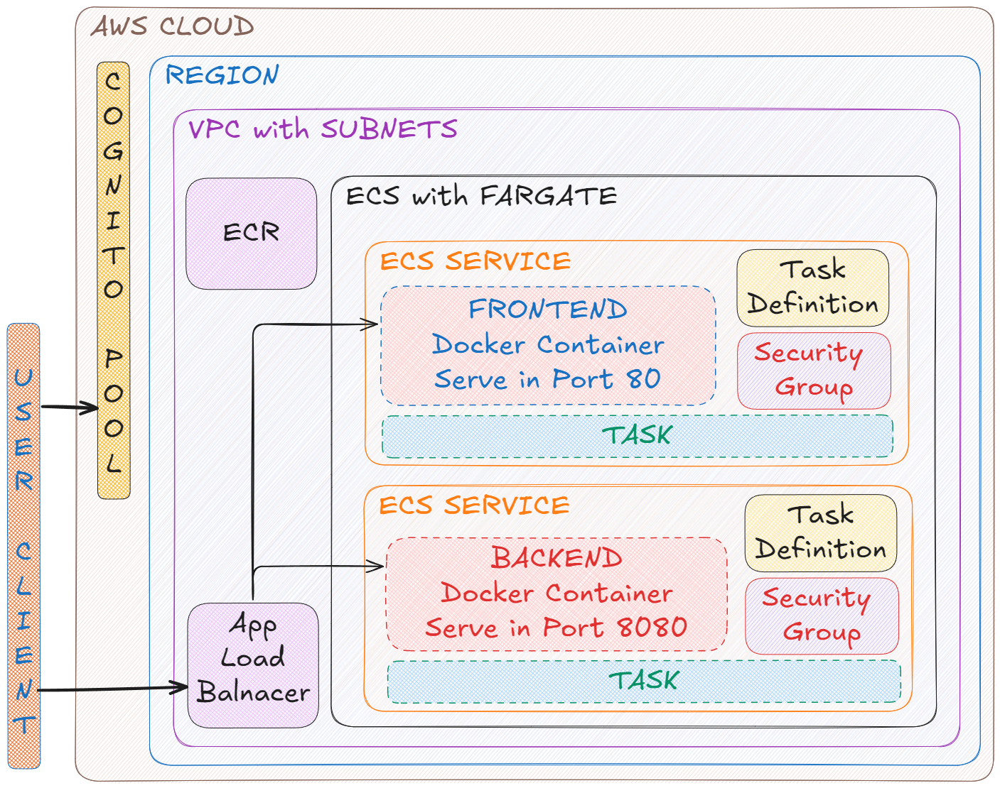

# Password Validator Challenge

Este repositório contém a implementação para um desafio de projeto, com objetivo de implementação de uma solução para um problema proposto, envolvendo a construção de um frontend e um microsserviço utilizando Amazon Cloud (AWS).

O repositório é composto por uma pasta **frontend** desenvolvido em **Angular** e outra pasta **backend** desenvolvido em **Spring Boot**. 

A comunicação entre a aplicação e o microsserviço acontece através de autenticação via **Client Credentials**. 

Ambos os projetos estão conteinerizados utilizando Docker e orquestrados com Docker Compose.

## Sumário

- [Visão Geral](#visão-geral)
- [Tecnologias Utilizadas](#tecnologias-utilizadas)
- [Estrutura do Projeto](#estrutura-do-projeto)
- [Arquitetura](#arquitetura)
- [Configuração e Execução](#configuração-e-execução)
- [Explicação Funcional](#explicação-funcional)

## Visão Geral

A aplicação permite ao usuário verificar a conformidade de uma senha, com base em determinados critérios:

- **Comprimento mínimo**: 8 caracteres
- **Pelo menos 1 dígito**
- **Pelo menos 1 letra minúscula**
- **Pelo menos 1 letra maiúscula**
- **Pelo menos 1 caractere especial** (considerando `!@#$%^&*()-+`)
- **Sem caracteres repetidos**
- **Sem espaços em brancos**

## Tecnologias Utilizadas

- **Frontend** | `Node 22` | `Angular 18` | `Nginx 1.26.2` |

- **Backend** | `Java 21` | `Maven 3.9.9` | `Spring Boot 3.3.3` |

- **Orquestração** | `Docker` | `Docker Compose` |

- **Autenticação**: | `Amazon Cognito` |

- **Hospedagem (AWS)**:
    - Processo Manual
        - `EC2` Elastic Compute Cloud 
    - Processo Automatizado
        - `ECR` Elastic Container Registry 
        - `ECS` Elastic Container Service
        - `ELB` Elastic Load Balancing

## Estrutura do Projeto

### Frontend (Angular)

- Aplicação foi construída com NG CLI e atualizada com @angular/elements
    - Em desenvolvimento, o elemento utilizado é do próprio Angular (Componente Standalone)
    - Em ambiente, o elemento utilizado é um web-component compilado no lugar do bootstrap da aplicação
- A organização do projeto contém:
    - Arquivos de configuração
    - Compilação dinâmica usando variáveis de ambiente
    - Serviço de autenticação por meio de Client Credentials
    - Interceptador para adição do token de acesso e comunicação com o microsserviço
    - Separação do componente e serviço responsável por realizar a validação da senha
- A interface de usuário permite:
    - Se autenticar para obtenção do token
    - Selecionar o endpoint da API que será consultada (ambiente e desenvolvimento)
    - Inserir uma senha e realizar a validação com base nos critérios específicos  
- Comunicação com o backend através de chamada HTTP autenticada via Client Credentials

### Backend (Spring Boot)

- Microsserviço (API) responsável pela lógica de validação da senha
- A organização do projeto contempla:
    - Serviço responsável por validar a senha
    - Controller responsável por mapear o endpoint para o path de acesso da API
    - Configuração para gerenciamento de controle de autenticação e CORs
- Implementação da lógica com os critérios de validação

**Orquestração**:

- Disponibiliza a construção do container que será executado para deploy
    - Permitindo acesso aos endpoints por meio de servidor web do front e do backend
- Gerenciamento dos projetos em um mesmo repositório por meio do Docker Compose

4. **Github Actions**

Automatiza o processo de implantação dos projetos via container, através de:

- Configuração de credencias de execução com a AWS 
    - Usuário "github-actions" no IAM com políticas especificas e par de chaves para autenticação
- Configuração de secrets com as variáveis necessárias para a implantação dos projetos
- Autenticação usando as credencias de acesso do usuário criado
- Criação e publicação das imagens de cada projeto
- Envia as imagens geradas para o registry no ECR
- Atualiza os serviços do ECS com as tasks definitions forçando um novo deploy das imagens geradas
- Espera pela atualização do serviço e execução da task forçando um novo deploy

## Arquitetura

> Arquitetura Frontend e Backend

> Arquitetura Deploy Manual EC2 Instance

> Arquitetura Deploy Automatizado com Github Actions 

### Considerações AWS Cloud

- **Cognito**: autenticação via Client Credentials entre o frontend e o micro serviço. As credenciais da aplicação são usadas para obter o token de acesso para uma chamada segura à API.
- **ECR**: repositório de imagens Docker para o frontend e o backend. As imagens são armazenadas no ECR após serem construídas e são referenciadas pelas definições de tarefa no Amazon ECS para serem implantadas e executadas.
- **ECS com Fargate**: orquestra os contêineres. Há um cluster ECS que contém dois serviços: um para o frontend e outro para o backend. Cada serviço está vinculado a uma task definition, que especifica a imagem Docker a ser utilizada (armazenada no ECR) e os recursos alocados (CPU, memória, portas).
- **ALB**: distribui o tráfego entre o frontend (na porta 80) e o backend (na porta 8080), além disso, garante que o endpoint seja fixo e não mude a cada novo deploy, enquanto distribui a carga entre os contêineres do ECS.
- **Security Groups**: regras de firewall definidas com menor privilégio (permitindo acesso apenas a portas específicas) controlando o tráfego de entrada e saída para recursos da AWS
- **VPC**: rede privada padrão utilizada para rodar os serviços ECS, onde o frontend quanto o backend estão acessíveis externamente via internet (através do ALB).

## Configuração e Execução

### Pré-requisitos

- **Opção 01** (Com Docker)
    - Docker CLI
    - Docker Compose
    - Docker em Execução

- **Opção 02** (Sem Docker)
    - Frontend: NODE 22
    - Backend: Java 21 e Maven 3

### Passos para Rodar a Aplicação

#### Opção 01 (Com Docker)

**Construir e iniciar os containers**

Na **raiz** do repositório, execute:

`docker compose up -d`

> - O `compose` utilizará as imagens de cada projeto para compilar, testar e subir as aplicações
> - O parâmetro `-d` executa as imagens em segundo plano, sem bloquear o terminal

Após carregamento dos projetos pelo docker, acesse a aplicação em `http://localhost`

**Interromper os containers**

Depois de testar a aplicação, na raiz do repositório, execute:

`docker compose down -v`

> - O `compose` irá parar os containers em execução
> - O parâmetro `-v` remove os volumes associados aos containers

#### Opção 02 (Sem Docker)

**Frontend**

Navegar para dentro da pasta `./frontend`, e então executar:

- `npm run install`
- `npm run start`

**Backend**

Em outro terminal, navegue para dentro da pasta `./backend`, e então execute:

- `mvn install`
- `mvn spring-boot:run`

Após subir os dois projetos, acesse a aplicação em `http://localhost:4200`

## Explicação Funcional

Ao acessar a aplicação, encontrará:

- Um botão que realizará a autenticação client credentials a um authorization server, obtendo o token de acesso necessário par comunicação com o micro serviço
- Um campo para seleção do tipo de endpoint da API a ser consultada (abordagem para cobertura de cenário em desenvolvimento ou diretamente nos ambientes de deploy na AWS usando EC2 ou um LoadBalancer)
- Um campo de formulário para digitar uma senha a ser validada
- Um botão de validação que realizará o envio da senha para ser validado pela API

[Video de demonstração da aplicação](https://www.youtube.com/watch?v=ByGhsipzw0I)

**URLS** de implantação: 

- `EC2`: http://ec2-44-203-94-189.compute-1.amazonaws.com 
- `ALB`: http://pwd-validator-alb-857814613.us-east-1.elb.amazonaws.com

> Obs.: as URLs possivelmente estarão desabilitadas, devido a custos de disponibilização.

